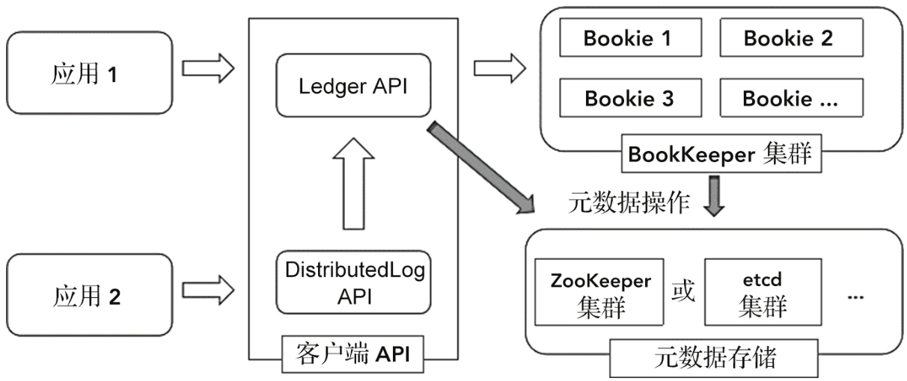
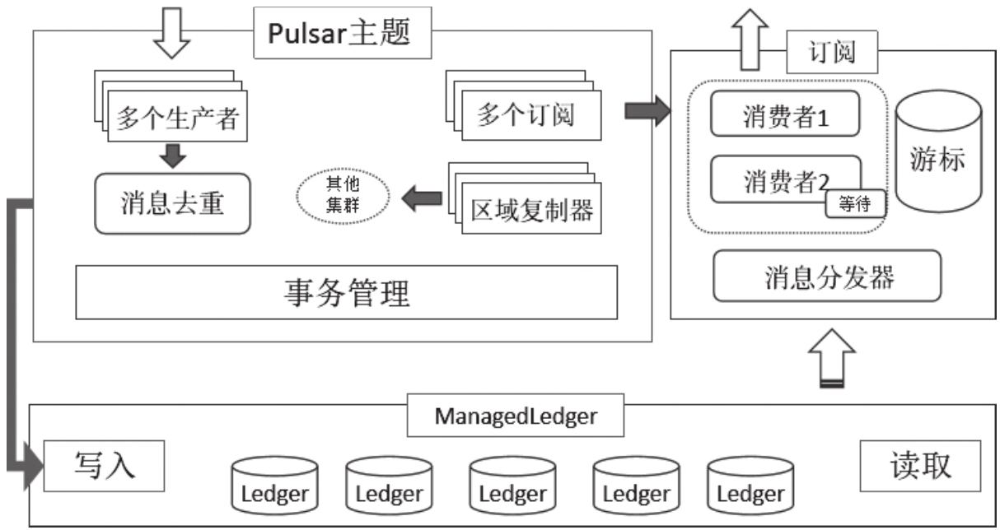

# 《Apache Pulsar原理解析与应用实践》

# 01 Pulsar概述
## 1.1 Pulsar是什么
Pulsar是一个分布式发布、订阅（pub-sub）消息的平台，具有非常灵活的消息传递模型以及跨语言的客户端API。Pulsar也是一个集消息传递、消息存储、轻量化函数式计算于一体的流数据平台。Pulsar采用了计算与存储分离的架构，支持云原生、多租户、持久化存储、多机房跨区域数据复制等，具有高一致性、高吞吐、低延时及高可扩展性等流数据存储系统特性。

## 1.2 Pulsar的优势
在诸多优秀的开源消息队列，如RabbitMQ、RocketMQ和Kafka的基础上，Pulsar实现了很多上一代消息系统或者上一代流数据系统没有实现的功能和特性，比如云原生、多租户、存储与计算分离、分层存储等。
### 1.2.1 Pulsar不只是消息队列
1. Pulsar是一个分布式消息平台，可以同时处理流式数据和异构系统数据对接这两类问题。这是因为Pulsar具有非常灵活的消息传递模型。
2. 为了实现更加丰富的消费模式，Pulsar提出了订阅的概念。Pulsar提供了多种订阅模式—独占模式（Exclusive）、故障切换模式（Failover）、共享模式（Shared）、键共享模式（Key_Shared）
3. Pulsar是一个集消息传递、消息存储、轻量化函数式计算于一体的流数据平台。
4. Pulsar是一个分布式可扩展的流式存储系统，并在数据存储的基础上构建了消息队列和流服务的统一模型。

### 1.2.2 存储与计算分离
**1.需要分离原因**

在Kafka中，每个分区的管理与存储职能都依赖其中一个服务端节点（承担分区Leader角色的Broker节点）。该节点在处理数据写入请求的同时，会将数据写到本机的存储路径下，并负责向其他副本写入数据。在数据的读取过程中，该节点负责读取磁盘数据并发送回客户端。在Kafka的架构中，存储与计算功能都由一个Kafka Broker节点负责。

无论计算资源和存储资源谁先达到瓶颈，都需要增加机器，所以可能会浪费很多机器资源。当对存储资源进行扩容时，在计算和存储混合的模式下可能需要迁移大量数据，进而大大增加扩容成本。

**2.Pulsar存储计算分离原理分析**

Pulsar是一个存储与计算分离的消息队列，其中提供计算服务的角色被称为Broker，提供存储服务的角色被称为Bookie

Broker提供的是无状态的计算服务，在计算资源不足时可独立扩容。Bookie提供的是有状态的存储服务，Pulsar中的数据会以数据块的形式分配到不同的Bookie节点。当存储资源不够时，可通过增加Bookie节点进行扩容。Pulsar会感知Bookie集群的变化，并在合适的时机使用新增加的Bookie节点进行存储，这就避免了人为迁移数据的操作。

### 1.2.3 云原生架构
Pulsar是一个云原生应用，拥有诸多云原生应用的特性，如无状态计算层、计算与存储分离，可以很好地利用云的弹性（伸缩能力），从而具有足够高的扩容性和容错性。Pulsar采用的存储与计算分离架构在云原生环境中有着更大的价值。Pulsar实例中的存储节点可以由一组Bookie容器负责，计算节点由一组Broker容器负责。存储与计算节点可以完全独立扩缩容，通过Kubernetes这样的容器编排工具，业务方可以快速构建可弹性扩缩容的云原生消息队列。

### 1.2.4 存储特性
Pulsar利用BookKeeper实现了分块存储的能力，在BookKeeper中，Ledger代表一个独立日志块或一段数据流，是持久化存储的单元。记录会被有序地写入Ledger中。数据一经写入就不允许进行修改了。Pulsar能够将每个主题映射为多个独立的数据段，每个数据段对应一个Ledger。

### 1.2.5 消息传输协议
目前Pulsar已经支持Kafka、RocketMQ、AMQP和MQTT等多种协议。

### 1.2.6 消费方式
RocketMQ与Kafka都基于Pull模式进行数据读取。Pull模式的优势在于可以控制数据的消费速度和消费数量，保证消费者不会达到饱和状态。但是在没有数据时，会出现多次空轮询，浪费计算资源。

Pulsar中的消费者在读取数据时采用以Push模式为主、Pull模式为辅的同步模式。Pulsar中的客户端有一个缓冲队列。客户端会向服务端发送流量配额请求，服务端会主动向客户端推送配额允许范围内的数据。消费者连接建立后，服务端通过配额向消费者推送数据。与此同时，消费者每消费一条数据都会增加客户端流量配额计数，在配额计数达到队列的一半时，客户端会再次发送流量配额请求，请求服务端推送数据。

### 1.2.7 性能与可靠性
Pulsar通过BookKeeper实现了数据的高可靠。在BookKeeper中Ledger是基本的持久化存储单元。Pulsar的每个主题的数据都会在逻辑上映射为多个Ledger。每个Ledger在服务端会存储多个副本。

在Broker端每个主题都是逻辑主题，这使其可以轻松支持海量主题。为了获取更好的性能，BookKeeper客户端在写入多副本时，也是由客户端完成多副本写入操作的，而不是采用服务端复制的方式

### 1.2.8 语义支持与一致性级别
Pulsar可以通过幂等生产者在单个分区上写入数据，并保证其可靠性。通过客户端的自增序列ID、重试机制与服务端的去重机制，幂等生产者可以保证发送到单个分区的每条消息只会被持久化一次，且不会丢失数据。

### 1.2.9 扩展能力
Pulsar的服务端的Broker负责接入、计算、分发消息等职能，Bookie负责消息存储，两者均可以按需动态地进行扩缩容处理。服务端会周期性地获取各个Broker节点的负载情况，并根据负载情况进行负载均衡，即每次扩容后都可以自动进行负载均衡。

### 1.2.10 消息模式
Pulsar采用的是发布订阅模式

### 1.2.11 多租户
多租户是一种软件架构技术，主要用来实现多用户的环境下共用相同的系统或程序组件，并确保各用户的数据具有一定的隔离性。

Pulsar租户可以分布在多个集群中，并且每个租户都可以应用自己的身份验证和授权方案。命名空间是租户内的独立管理单元。在命名空间上设置的配置策略适用于在该命名空间中创建的所有主题。

### 1.2.12 延迟队列
支持秒级的延迟消息，所有延迟投递的消息都会被内部组件跟踪，消费组在消费消息时，会先去延迟消息追踪器中检查，以明确是否有到期需要投递的消息。如果有到期的消息，则根据追踪器找到对应的消息进行消费；如果没有到期的消息，则直接消费非延迟的正常消息。延迟时间长的消息会被存储在磁盘中，当快到延迟时间时才被加载到内存里。

### 1.2.13 重试和死信队列
在Pulsar中某些消息可能会被多次重新传递，甚至可能永远都在重试中。通过使用死信队列，可让消息具有最大重新传递次数。当实际传递次数超过最大重新传递次数时，对应的消息会被发送到死信主题并自动确认。

# 02 Pulsar的基本概念和架构详解
## 2.1 多租户与命名空间
Pulsar的多租户系统可在多租户环境下使用同一套程序，且保证租户间资源与数据隔离。命名空间是租户内的独立管理单元。用户可以通过设置不同级别的策略来管理租户和命名空间，可以独自管理存储配额、消息过期时间（TTL）和隔离策略等配置。

## 2.2 主题
在Pulsar中，消息存储与管理的基本单位是主题，而在主题内消息的基本管理单位是数据段，所以可以认为数据段是Pulsar中最小的信息管理单位。

### 2.2.1 分区主题和非分区主题
在非分区主题中，主题被创建后，不能修改分区，整个主题由一个Borker服务节点独立提供服务，服务包括订阅管理、消费者管理、生产者管理等。而分区主题在逻辑上可被划分为多个非分区主题。假设persistent://public/default/topic被划分为3个非分区主题—persistent://public/default/topic-parition-0、persistent://public/default/topic-parition-1、persistent://public/default/topic-parition-2，那么persistent://public/default/topic就是一个分区主题。通过主题名可以指定主题的生产或者消费方式，此时Pulsar会自动根据路由规则访问带有“-partition-*”的逻辑分区主题。

```shell
#创建非分区主题
cd ../pulsar2.7/
bin/pulsar-admin topics create persistent://public/default/topic
bin/pulsar-admin topics list public/default
"persistent://public/default/topic"
"persistent://public/default/my-topic"

#创建分区主题
bin/pulsar-admin topics create-partitioned-topic persistent://public/default/partition-topic -p 3
bin/pulsar-admin topics list public/default
"persistent://public/default/partition-topic-partition-0"
"persistent://public/default/partition-topic-partition-1"
"persistent://public/default/partition-topic-partition-2"
"persistent://public/default/my-topic"

```
### 2.2.2 持久化主题和非持久化主题
Pulsar默认创建持久化主题，在非持久化主题中，服务端收到消息后会直接转发给当前的所有消费者。非持久化主题的地址以non-persistent开头，例如non-persistent://tenant/namespace/topic

## 2.3 生产者

1. 一对一
- 由服务端处理该生产者的所有消息发送请求
2. 一对多
- 轮询路由模式：该模式可保证吞吐量优先，但是单个分区的消息会被打散分发到各个服务端节点。
- 单分区模式：该模式会将当前生产者的所有消息分发到某个分区。
3. 多对多
- 共享模式：共享模式下多个生产者都可以发送消息到服务端，服务端按照接收顺序依次处理各条消息。
- 独占模式：独占模式下仅有一个生产者可以连接至服务端。如果新生产者在建立之前已经有其他生产者成功连接至服务端，那么新的生产者的建立会失败并抛出异常。
- 独占等待模式：独占等待模式仅有一个生产者可以发送消息至服务端。在新建生产者时，如果对应服务端已经连接了其他生产者，则生产者新建进程将被挂起，直到生产者获得独占访问权限。

## 2.4 消费者与订阅

## 2.4.1 订阅
默认情况下Pulsar提供的是持久化订阅，使用同一个订阅的消费者会在服务端存储消费的位置，并在重启后在上次消费的位置继续消费消息。在客户端，用户可以选择非持久化订阅模式。消费者在使用非持久化订阅模式时，若是退出消费，则当前订阅会被服务端释放，且不会存储本次消费的位置。

### 2.4.1.1 独占模式


每个订阅只允许一个消费者接入。若订阅的主题是多分区主题，消费者也会独占多个分区。独占模式是Pulsar默认的订阅模式。

### 2.4.1.2 故障转移模式


Pulsar会为非分区主题或分区主题的每个分区选择一个主消费者并接收其消息。当主消费者断开连接时，所有消息都会传递给下一个消费者。对于分区主题，服务端将根据优先级和消费者的名称在字典中的顺序对消费者进行排序。然后，服务端会尝试将主题均匀分配给具有最高优先级的消费者。对于非分区主题，服务端将按照消费者订阅非分区主题的顺序选择消费者。

### 2.4.1.3 共享模式


消息以循环分配的方式在消费者之间传递，并且任何给定的消息都只传递给一个消费者。当消费者断开连接时，所有发送给它但未被确认的消息将被重新安排发送给剩余的消费者。在这种模式下，由于消息发送具有随机性，所以多个消费者之间不能保证消息有序。

### 2.4.1.3 键共享模式


消息可以在多个消费者中传递，具有相同键的消息仅会被传递给一个消费者。在使用键共享模式时，必须为消息指定一个键。

### 2.4.1.4 传统发布订阅模式


应为每个消费者指定唯一的订阅名称，并使用独占模式。在这种配置下，每个消费者都会消费全量的Pulsar主题消息

### 2.4.1.5 队列模式


在多个消费者之间共享相同的订阅名称，此时多个消费者可共同消费一份全量消息

## 2.4.2 消费者
### 2.4.2.1 消费
```shell
bin/pulsar-client consume topic-test -s "subscription_test" --subscription-position Earliest
```
-s参数指定了当前使用的订阅的名称，这里为subscription_test。如果此订阅名从未被使用过，则服务端会创建一个新订阅。如果此订阅被使用过，则服务端会从上次消费的位置开始继续消费消息。参数--subscription-position代表该订阅在第一次被使用时需要初始化的位置。Earliest表示消费位置应该被初始化为主题中能消费的最早一条消息所在的位置。Latest表示消费位置应该被初始化为主题中最后一条消息的位置,如下图


### 2.4.2.2 消息保留与消息过期


（消息已过期和未过期反了？？？）

消息保留策略用于控制能够存储多少已被消费者确认的消息，消息过期策略用于为尚未确认的消息设置生存时间，本身不删除数据，只是更改状态为已确认

## 2.5 Pulsar逻辑架构
### 2.5.1 主题的配置管理


租户、命名空间与主题之间关系如上图所示。

在主题视角下，租户代表基本的用户权限和集群权限，命名空间代表一类应用场景共同拥有的数据策略。例如在金融类业务下，命名空间中的主题可以牺牲一部分吞吐量来保障较高的可靠性。

资源隔离机制允许用户为命名空间分配资源，包括计算节点Broker和存储节点Bookie。pulsar-admin管理工具提供了ns-isolation-policy命令，该命令可以为命名空间分配Broker节点，并限制可用于分配的Broker。pulsar-admin管理工具的namespaces命令中的set-bookie-affinity-group子命令提供了Bookie节点的分配策略，该策略可以保证所有属于该命名空间的数据都存储在所需的Bookie节点中。

### 2.5.2 主题的数据流转


用户将消息写入Pulsar时，客户端请求会被发送到管理该主题的Broker节点上，然后Broker节点会负责将消息写入Bookie节点中的某个Ledger中，在写入成功后Broker节点会将成功写入的状态返回给客户端


在消费消息时，Pulsar会先尝试从Broker节点的缓存中读取消息，如果不能命中消息，则会从Bookie节点中读取消息，并最终将消息发送给消费者

### 2.5.3 主题的数据存储


主题的数据在逻辑上被分解为多个片段（Segment）。片段在BookKeeper集群中对应着物理概念上的最小的分布单元—Ledger。每个Ledger都是一个独立的日志文件，一个主题中多个Ledger不会同时提供写入功能，同一时刻只会有一个Ledger处于开放状态并提供数据写入功能。Ledger在Pulsar中是最小的删除单元，因此我们不能删除单条记录，只能删除整个Ledger。


每一条消息都会包含分区序号（partition-index）、Ledger序号（ledger-id）、Entry序号（entry-id）以及批内序号（batch-index）等信息，这些信息用来唯一确定一条消息

## 2.6 Pulsar物理架构
### 2.6.1 集群与实例


实例代表一个或多个Pulsar集群的集合。实例中的集群之间可以相互复制数据，实现跨区域的数据备份。一个实例内的多个集群依赖Zookeeper集群实现彼此之间的协调任务，例如异地复制。
### 2.6.2 分层存储架构


Pulsar的分层存储功能允许将较旧的积压数据卸载到可长期存储的系统中，例如Hadoop HDFS或Amazon S3。分层存储卸载（Offload）机制利用了这种面向数据段的架构。当请求卸载时，日志的数据段被一个一个地复制到分层存储系统中。命名空间策略可以配置为在达到阈值后自动卸载数据至分层存储系统中。一旦主题中的数据达到阈值，就会触发卸载操作。
### 2.6.3 核心组件与服务
1. Zookeeper：Zookeeper负责与分布式协调、部分元数据存储相关的工作
- 用于协调Pulsar实例中多个Pulsar集群的全局Zookeeper集群。在全局Zookeeper集群中，会存储Pulsar实例中多个Pulsar集群的信息，并在异地复制等多集群功能中发挥作用。
- 负责协调单个Pulsar集群的Zookeeper集群。这类Zookeeper集群会协调整个Pulsar集群的元数据管理和一致性工作，比如Broker节点状态、命名空间信息存储、命名空间Bundle分配、Ledger状态存储、订阅元数据信息以及负载均衡等。
2. Broker：生产消费服务与Pulsar管理服务
- 消息队列的生产与消费的基本功能。生产者可以连接到Broker节点发布消息，消费者可以连接到Broker节点来消费消息，在读取消息时如果能在Broker节点的缓存中命中消息，则直接从缓存中读取消息
- 以REST API的形式提供HTTP服务。Broker节点可以为租户和命名空间提供管理功能，为主题提供服务发现功能，为生产者和消费者提供管理接口，还可以为用户提供针对Pulsar Function、Pulsar I/O的管理功能。
3.  BookKeeper与Bookie：通过分布式预写日志实现的数据存储组件

    
  在BookKeeper中除了Ledger外，还有日记账（Journal）、内存表（Memtable）、账目日志（Entry Log）、索引缓存（IndexCache）等概念

- 在数据写入BookKeeper的Ledger后，数据会首先写入日记账中，日记账代表Bookie中一个追加写入的预写日志，并被持久化到日记账磁盘中。在数据被持久化到日记账磁盘时，才会进行真正的数据写入操作。来自不同Ledger的日志数据被聚合并按顺序写入账目日志，数据存储的偏移量会作为指针保存在Ledger索引缓存中，以帮助实现快速查找功能。多个Ledger的数据会被顺序写入磁盘中，这确保了不会因为有过多的Ledger而影响磁盘的写入速度。但是这种方式需要维护额外的索引文件来保障数据读取速度。BookKeeper为每个Ledger分别创建了一个索引文件，这些索引文件记录了存储在记录日志中数据的偏移量。Ledger索引文件会被缓存在内存池中，这样可以更有效地管理磁盘磁头调度
4. 代理服务发现
   Pulsar代理在Pulsar中是一个无状态的代理组件。Pulsar客户端在连接服务端时，可以直接指定Broker的地址，也可以配置Pulsar代理的地址，然后由Pulsar代理将请求转发至Broker节点。Pulsar代理具有Broker节点无状态的性质，通过使用Pulsar代理服务发现组件，所有查找主题和数据连接都流经Pulsar代理。这样的代理可以在云原生环境下以多种模式公开，进而更好地发挥Pulsar的云原生特性。

## 03 Pulsar的基本操作
### 3.1 生产者开发
#### 3.1.1 消息：
- 键：
  键是消息中可选的一个配置参数，每个消息最多可以设置一个键的值。生产者发送数据到服务端时，由分区路由规则决定将该键值发送到哪个分区。主题压缩采集也会根据键值来压缩历史消息。
- 生产者名：
  顾名思义，就是生产者的名字。每条消息都会通过生产者名来记录每条消息是被哪个生产者发送的，所以该生产者名必须全局唯一，用户可以为生产者指定名称，也可以不指定，在不指定时系统会自动生成一个唯一的名称。
- 序列号：
  序列号由生产者分配，和生产者名一样，可以唯一定义一条消息。
- 发布时间：
  标记一条消息在生产者中发布的时间。
- 事件时间：
  区别于发布时间，事件时间代表该条消息在其生产设备上生成的时间。该属性可以在基于事件的流处理系统中进行计算处理。
- 属性：
  这是一个由用户自定义的属性集合。生产者可以在发送消息的同时附带一系列属性。这些属性可以在消费者中被访问。


#### 3.1.2 消息流转流程：
1. 原始数据结合模式信息、元数据信息变成Pulsar中的消息。如果在生产者端配置了拦截器，则消息会被处理，而被处理后的消息也会被生产者端得到。
2. 根据生产者端的配置决定消息的发送形式。发送形式包括单条发送、分批发送（将多条消息打包为一条消息）、分块发送（将一条消息拆分为多条消息发送）。
3. Pulsar客户端会将写入数据的请求通过通信协议发送到服务端，服务端收到数据写入请求后进行写入操作，并在服务端确认写入持久化存储后，发送确认请求到生产者中
4. 客户端将该条消息从待处理消息队列中移除，并调用该消息之前配置的回调方法，以完成部分回调操作

```xml
<dependency>
    <groupId>org.apache.pulsar</groupId>
    <artifactId>pulsar-client</artifactId>
    <version>2.7.1</version>
</dependency>
```

#### 3.1.3 获取pulsar客户端：
```text
PulsarClient.builder().serviceUrl(PULSAR_SERVICE_URL).build();
```
相关参数：
> - serviceUrl：
    必填参数。配置Pulsar服务访问的链接
> - numIoThreads：
    处理服务端连接的线程个数。默认为1。
> - numListenerThreads：
    主要用于消费者，处理消息监听和拉取的线程个数。默认为1。
> - statsIntervalSeconds：
    通过日志来打印客户端统计信息的时间间隔。默认为60秒。
> - connectionsPerBroker：
    在客户端处理Broker请求时，每个Broker对应建立多少个连接。默认为1。
> - memoryLimitBytes：
    客户端中的内存限制参数。默认为0。
> - operationTimeoutMs：
    网络通信超时时间。默认为30000毫秒。
> - keepAliveIntervalSeconds：
    每个客户端与服务端连接保持活动的间隔时间。在客户端底层会按照该参数周期性确认连接是否存活。默认为30秒。
> - connectionTimeoutMs：
    与服务端建立连接时的最大等待时间。默认为10000毫秒。
> - requestTimeoutMs：
    完成一次请求的最大超时时间。默认为60000毫秒。
> - concurrentLookupRequest：
    允许在每个Broker连接上并行发送的Lookup请求的数量，用来防止代理过载。Lookup请求用于查找管理某个主题的具体Broker地址。默认为5000个请求。
> - maxLookupRequest：
    一个Broker上允许的最大并发的Lookup请求数量。该参数与concurrentLookupRequest共同生效。默认为50000个请求。
> - maxNumberOfRejectedRequestPerConnection：
    当前连接关闭后，客户端在一定时间范围内（30秒）拒绝的最大请求数，超过该请求数后客户端会关闭旧的连接并创建新连接来连接不同的Broker。默认为50个连接。
> - useTcpNoDelay：
    这是一个网络通信底层参数，用于决定是否在连接上禁用Nagle算法。默认为True。
> - authPluginClassName：
    鉴权插件的类名。在服务端配置了鉴权时选择鉴权方式。
> - authParams：
    鉴权参数。和authPluginClassName一起使用，提供配置类型的鉴权参数。
> - useTls：
    是否在连接上使用TLS加密方式。
> - tlsTrustCertsFilePath：
    TLS加密的证书地址。
> - tlsAllowInsecureConnection：
    用于决定客户端是否接受Broker服务端的不可信证书。
> - tlsHostnameVerificationEnable：
    用于决定是否开启TLS主机名校验。

```java
public class ClientDemo {
    public static void main(String[] args) {
        ClientDemo.sendMessage();
    }

    public static void sendMessage() {
        PulsarClient clinet;
        try {
            clinet = PulsarClient.builder()
                    .serviceUrl(PulsarClientUtil.PULSAR_SERVICE_URL)
                    .ioThreads(1)
                    .listenerThreads(1)
                    .build();

            Producer<byte[]> producer = clinet.newProducer()
                    .topic("demo_topic")
                    .create();
            // 同步发送
            producer.send("同步消息".getBytes());
            // 异步发送
            producer.sendAsync("异步消息".getBytes())
                    .thenAccept(msgId -> System.out.println("发送成功"))
                    .exceptionally(throwable -> {
                        System.out.println("发送失败");
                        return null;
                    });
            producer.close();
            clinet.close();
        } catch (PulsarClientException e) {
            throw new RuntimeException(e);
        }
    }

    // 发送指定key的消息
    public static void sendKeyMsg() throws PulsarClientException {
        PulsarClient client = PulsarClientUtil.getClient();
        Producer<KeyValue<String, String>> keyTopic =
                client.newProducer(Schema.KeyValue(Schema.STRING, Schema.STRING)).topic("key_topic").create();
        keyTopic.newMessage().value(new KeyValue<>("key", "key msg")).send();
    }
}
```
生产者相关参数：
> - producerName：
为生产者命名，若不指定名称则会自动创建一个唯一的名称。
> - sendTimeoutMs：
写入消息的超时时间。如果在该时间范围内未收到服务端的确认回复则会抛出异常。默认为30000毫秒。
> - maxPendingMessages：
保存一个生产者待处理消息的队列，该队列中存放的是尚未被服务端确认写入的消息数量。默认为1000。当该队列存满之后将通过blockIfQueueFull参数决定如何处理。
> - blockIfQueueFull：
在发送消息到服务端时会将消息放在内存队列中，该参数控制在内存队列满了之后的处理行为。设为True则阻塞客户端的写入，设为False则不阻塞队列而是直接抛出异常。默认为False。
> - maxPendingMessagesAcrossPartitions：
在同一个主题下，不同分区内的多个生产者同用的最大待处理消息的总数量。与maxPendingMessages参数共同作用，最后生效的maxPendingMessages的值不得大于maxPendingMessagesAcrossPartitions除以分区数所得到的值。
> - messageRoutingMode：
针对分区主题的消息路由规则，决定一条消息实际被发送到哪个分区内。
> - hashingScheme：
针对分区主题的消息路由规则，指定一条消息的哈希函数。
> - cryptoFailureAction：
当加密失败时，生产者应该采取的发送行动。该参数的值为FAIL表示如果加密失败，则未加密的消息无法发送；该参数的值为SEND表示如果加密失败，则发送未加密的消息。默认为FA I L。
> - batchingEnabled：
是否允许批处理发送。
> - batchingMaxPublishDelayMicros：
发送批处理消息的最大延迟时间。
> - batchingMaxMessages：
发送批处理消息的最大数量。
> - compressionType：
消息压缩方式。

#### 3.1.4 数据发送路由规则:
1. 轮询路由模式
- 没有提供消息的键值，生产者会按照轮询策略跨所有分区发布消息
- 指定了一个键值，则分区的生产者会对该键值进行散列并将消息分配给特定的分区。
2. 单分区模式
- 未提供消息的键值，则生产者会随机选择一个分区并将所有消息发布到该分区。
- 指定了一个键值，则分区的生产者会对该键值进行哈希运算并将消息分配给特定的分区
3. 自定义分区模式
- 通过调用自定义的消息路由器来确定消息发往的分区
```java
public class RandomRouter implements MessageRouter {
    static Random random = new Random();
    @Override
    public int choosePartition(Message<?> msg, TopicMetadata metadata) {
        int numPartitions = metadata.numPartitions();
        return random.nextInt(numPartitions);
    }
}
```

#### 3.1.5 分批发送和分块发送:
```text
// 批量发送
public static Producer<byte[]> getBatchProducer() throws PulsarClientException {
    PulsarClient client = getClient();
    return client.newProducer()
            .topic("batch-topic")
            .batchingMaxPublishDelay(10, TimeUnit.MILLISECONDS)
            .sendTimeout(10, TimeUnit.SECONDS)
            .enableBatching(true)
            .create();
}

// 大数据下一条数据分块发送
public static Producer<byte[]> getChunckProducer() throws PulsarClientException {
    PulsarClient client = getClient();
    return client.newProducer(Schema.BYTES)
            .topic("chunk-topic")
            .enableChunking(true)
            .enableBatching(false)
            .create();
}
```

### 3.1.6 生产者拦截器
```java
public class UpperConsumerInterceptor implements ProducerInterceptor {
    @Override
    public void close() {

    }

    @Override
    public boolean eligible(Message message) {
        if (message instanceof MessageImpl) {
            return (((MessageImpl) message).getSchema()) instanceof StringSchema;
        }
        return false;
    }

    @Override
    public Message beforeSend(Producer producer, Message message) {
        byte[] rawData = new String(message.getData()).toUpperCase().getBytes();
        return MessageImpl.create(((MessageImpl<?>) message).getMessageBuilder(), ByteBuffer.wrap(rawData), StringSchema.utf8());
    }

    @Override
    public void onSendAcknowledgement(Producer producer, Message message, MessageId messageId, Throwable throwable) {

    }
}
```

## 3.2 消费者开发
### 3.2.1 消费订阅
#### 3.2.1.1 普通消费
```java
public class ConsumerDemo {
    public static void main(String[] args) {
        receive();
    }
    public static Consumer<String> getConsumer() {
        PulsarClient client = PulsarClientUtil.getClient();
        try {
            return client.newConsumer(Schema.STRING)
                    .topic("demo_topic")
                    .subscriptionInitialPosition(SubscriptionInitialPosition.Earliest)
                    .subscriptionName("test_sub")
                    .subscribe();
        } catch (PulsarClientException e) {
            throw new RuntimeException(e);
        }
    }

    public static void receive() {
        Consumer<String> consumer = getConsumer();
        try {
            Message<String> msg = consumer.receive();
            System.out.println("收到消息：" + new String(msg.getData()));
            consumer.acknowledge(msg);
        } catch (PulsarClientException e) {
            throw new RuntimeException(e);
        }

    }
}
```
#### 3.2.1.2 异步接收与分批接收
```text
public static void asyncConsume() {
    Consumer<String> consumer = getConsumer();
    consumer.receiveAsync()
            .thenAccept((Message<String> msg) -> {
                System.out.println("receive:" + Arrays.toString(msg.getData()));
                try {
                    consumer.acknowledge(msg);
                } catch (PulsarClientException e) {
                    consumer.negativeAcknowledge(msg);
                }
            });
}

public static void batchConsume() throws PulsarClientException {
    Consumer<String> consumer = getConsumer();
    Messages<String> messages = consumer.batchReceive();
    for (Message<String> message : messages) {
        System.out.println("receive:" + Arrays.toString(message.getData()));
        // 单消息确认
        // try {
        //     consumer.acknowledge(message);
        // } catch (PulsarClientException e) {
        //     consumer.negativeAcknowledge(message);
        // }
    }
    // 批量确认
    consumer.acknowledge(messages);
}
```
消费者配置参数：
> - consumerName：
消费者的名字，类似生产者命名，是消费者的唯一身份凭证，需要保证全局唯一。若不指定，则系统会自动生成全局唯一的消费者命名。
> - topicNames：
topicName的集合，表示该消费者要消费的一组主题。
> - topicsPattern：
主题模式，可以按照正则表达式的规则匹配一组主题。
> - patternAutoDiscoveryPeriod：
和topicsPattern一起使用，表示每隔多长时间重新按照模式匹配主题。
> - regexSubscriptionMode：
正则订阅模式的类型。使用正则表达式订阅主题时，你可以选择订阅哪种类型的主题。PersistentOnly表示只订阅持久性主题；NonPersistentOnly表示仅订阅非持久性主题；AllTopics表示订阅持久性和非持久性两种主题。
> - subscriptionType：
定义订阅模式，订阅模式分为独占、故障转移、共享、键共享4种。
> - subscriptionInitialPosition：
提交了订阅请求，但是在当前时刻订阅未被创建，服务端会创建该订阅，该参数用于设定新创建的订阅中消费位置的初始值。
> - priorityLevel：
订阅优先级。在共享订阅模式下分发消息时，服务端会优先给高优先级的消费者发送消息。在拥有最高优先级的消费者可以接收消息的情况下，所有消息都会被发送到该消费者。当拥有最高优先级的消费者不能接收消息时，服务端才会考虑下一个优先级消费者。
> - receiverQueueSize：
用于设置消费者接收队列的大小，在应用程序调用Receive方法之前，消费者会在内存中缓存部分消息。该参数用于控制队列中最多缓存的消息数。配置高于默认值的值虽然会提高使用者的吞吐量，但会占用更多的内存。
> - maxTotalReceiverQueueSizeAcrossPartitions：
用于设置多个分区内最大内存队列的长度，与receiverQueueSize一同生效。当达到任意一个队列长度限制时，所有接收队列都不能再继续接收数据了。
下面是与消息确认相关的参数。
> - acknowledgementsGroupTimeMicros：
用于设置消费者分批确认的最大允许时间。默认情况下，消费者每100毫秒就会向服务端发送确认请求。将该时间设置为0会立即发送确认请求。
> - ackTimeoutMillis：
未确认消息的超时时间。
> - negativeAckRedeliveryDelayMicros：
用于设置重新传递消息的延迟时间。客户端在请求重新发送未能处理的消息时，不会立刻发送，而是会有一段时间的延迟。当应用程序使用negativeAcknowledge方法时，失败的消息会在该时间后重新发送。
> - tickDurationMillis：
ack-timeout重新发送请求的时间粒度。
其他高级特性的配置与使用。
> - readCompacted：
在支持压缩的主题中，如果启用readCompacted，消费者会从压缩的主题中读取消息，而不是读取主题的完整消息积压。消费者只能看到压缩主题中每个键的最新值。我们会在6.5节对此进行详细介绍。
> - DeadLetterPolicy：
用于启动消费者的死信主题。默认情况下，某些消息可能会多次重新发送，甚至可能永远都在重试中。通过使用死信机制，消息具有最大重新发送计数。当超过最大重新发送次数时，消息被发送到死信主题并自动确认。
> - replicateSubscriptionState：
如果启用了该参数，则订阅状态将异地复制到集群。
### 3.2.2 数据确认
消息一旦被生产者成功写入服务端，该消息会被永久存储，只有在所有订阅都确认后该消息才会被允许删除

#### 3.2.2.1 独立确认和累计确认
采用独立确认时，消费者需要确认每条消息并向服务端发送确认请求。采用累积确认时，消费者只需要确认它收到的最后一条消息就可确认该条消息及之前的消息。在非共享订阅模式中，包括独占模式与灾备模式可使用累计确认。

累计确认：
```text
client.newConsumer(Schema.STRING)
          .topic("demo_topic")
          .subscriptionInitialPosition(SubscriptionInitialPosition.Earliest)
          .subscriptionName("group_sub")
          .acknowledgmentGroupTime(100, TimeUnit.MICROSECONDS)
          .subscribe();
```

#### 3.2.2.2 确认超时与重试
有参数ackTimeout，在该参数内没被确认的消息会被重新发送，如下每5s重新发送一次
```text
// 超时,不确认每5s重新消费一次。被否认确认的消息会在固定超时时间后重新发送，
// 重新发送的周期由negativeAckRedeliveryDelay参数控制，默认为1min。
Consumer<String> consumer = client.newConsumer(Schema.STRING)
    .topic("demo_topic")
    .subscriptionInitialPosition(SubscriptionInitialPosition.Earliest)
    .subscriptionName("group_sub")
    .ackTimeout(5, TimeUnit.SECONDS)
    .acknowledgmentGroupTime(100, TimeUnit.MICROSECONDS)
    .subscribe();
while (true) {
    Message<String> msg = consumer.receive();
    System.out.println(msg.getData());
    // consumer.acknowledge(msg);
}

// 重试，在未指定死信配置（DeadLetterPolicy）时，客户端会自动以当前的主题名和订阅名生成默认重试主题
// 规则为${topic_name}-${subscription_name}-RETRY。
// 在调用reconsumeLater方法请求重新写入一条消息时，系统会自动发送确认请求到服务端
// 然后在配置的重试主题下，重新写入一条消息。在超过指定延迟时间后，客户端会重新消费该消息。
Consumer<String> consumer = client.newConsumer(Schema.STRING)
        .topic("demo_topic")
        .subscriptionInitialPosition(SubscriptionInitialPosition.Earliest)
        .subscriptionName("retry_sub")
        .enableRetry(true)
        .subscribe();
while (true) {
    Message<String> msg = consumer.receive();
    System.out.println(msg.getData());
    consumer.reconsumeLater(msg, 10, TimeUnit.SECONDS);
}
```

#### 3.2.2.3 消费者拦截器和监听器
与生产者拦截器相似，要想实现消费者拦截器，需要先实现ConsumerInterceptor接口。该接口中有以下几个方法。
> - beforeConsume：
在消息到达receive方法前进行拦截。
> - onAcknowledge：
在消费者向服务端发送调用请求前被调用。
> - onAcknowledgeCumulative：
在消费者向服务端发送累计确认请求前被调用。
> - onAckTimeoutSend：
当消息确认超时后，向服务端发送“重新发送请求”前被调用。
> - onNegativeAcksSend：
在消费者向服务端周期性发送否认确认请求前被调用


Pulsar的消费者客户端提供了两种类型的监听器—ConsumerEventListener和MessageListener。
1. ConsumerEventListener：用来监听消费者状态变动的监听器，可在故障转移模式下发生分区分配策略变化时监听状态的变动。
- becameActive在当前消费者获取到一个分区的消费权利时被调用
- becameInactive在当前消费者没有分区消费权利时被调用
2. MessageListener：在使用消息监听器时，receive方法不再提供服务
- 此时调用receive方法会收到客户端异常“Cannot use receive() whena listener has been set”（设置监听器后不能再使用receive()）
- 此时每条发向当前消费者的消息都会调用MessageListener.received方法

### 3.2.3 Reader开发
Pulsar的Reader接口可以使我们通过应用程序手动管理访问游标。当使用Reader接口访问主题时，需要指定Reader在连接到主题时开始读取的消息的位置，例如最早和最后可以访问到的有效消息位置

```text
Reader<String> reader = client.newReader(Schema.STRING)
        .topic("demo_topic")
        .startMessageId(MessageId.earliest)
        .create();
while (true) {
    Message<String> msg = reader.readNext();
    System.out.println(msg.getData());
}
```

### 3.2.4 模式管理
模式是一种数据类型的定义方法，提供了统一的类型管理和序列化（或反序列化）方式，可以减轻用户维护类型安全的工作量。通过使用模式，Pulsar客户端会强制执行类型安全检查，并确保生产者和消费者保持同步。

- **原始类型模式**
1. 字节数组（BYTES）：默认的模式格式。对应Java中的byte[]、ByteBuffer类型。
2. 布尔类型（BOOLEAN）：对应Java Boolean类型。
3. 整数类型（INT8、INT16、INT32、INT64）：按照数据所占字节不同又可分为8位、16位、32位和64位，对应Java的byte、short、int、long类型。
4. 浮点类型（FLOAT、DOUBLE）：分为32位的单浮点数和64位的双浮点数，对应Java的float和double。
5. 字符串（STRING）：Unicode字符串，对应着Java中的String类型。
6. 时间戳（TIMESTAMP、DATE、TIME、INSTANT、LOCAL_DATE、LOCAL_TIME、LOCAL_DATE_TIME）：时间字段类型，对应Java中的java.sql.Timestamp、java.sql.Time、java.util.Date、java.time.Instant、java.time.LocalDate、java.time.LocalDateTime、java.time.LocalTime类型。其中INSTANT代表时间线上的单个瞬时点，精度为纳秒。

Pulsar中对基本数据类型模式的使用方式是，在创建生产者和消费者时传入原始类型模式：
```text
Producer<String> producer = clinet.newProducer(Schema.STRING)
        .topic("demo_topic")
        .create();


Reader<String> reader = client.newReader(Schema.STRING)
        .topic("demo_topic")
        .startMessageId(MessageId.earliest)
        .create();
```

- **复杂类型模式**

复杂类型模式分为两类：键值对类型模式和结构体类型模式。

a. 键值对类型模式: 键值有两种编码形式—内联编码和分离编码。内联编码会将键和值在消息主体中一起编码；分离编码会将键编码在消息密钥中，将值编码在消息主体中。

```text
Schema<KeyValue<Integer, String>> inlineSchema = Schema.KeyValue(Schema.INT32, Schema.STRING, KeyValueEncodingType.INLINE);

Schema<KeyValue<Integer, String>> schema = Schema.KeyValue(Schema.INT32, Schema.STRING);
```

b. 结构体类型模式: 可以让用户很方便地传输Java对象

目前Pulsar支持AvroBaseStruct-Schema和ProtobufNativeSchema两种结构体类型模式。AvroBaseStructSchema支持Avro-Schema、JsonSchema和ProtobufSchema。利用Pulsar支持的几种模式可以预先定义结构体架构，它既可以是Java中的简单的Java对象（POJO）、Go中的结构体，又可以是Avro或Protobuf工具生成的类。ProtobufNativeSchema使用原生Protobuf协议的格式来进行序列化。

```text
Producer<DemoData> producer1 = client.newProducer(JSONSchema.of(DemoData.class)).create();

Producer<DemoData> producer2 = client.newProducer(AvroSchema.of(DemoData.class)).create();

// ProtobufSchema使用的对象需要继承GeneratedMessageV3
Producer<ProtocolData> producer3 = client.newProducer(ProtobufSchema.of(ProtocolData.class)).create();

Producer<ProtocolData> producer4 = client.newProducer(ProtobufNativeSchema.of(ProtocolData.class)).create();
```


## 04 核心组件原理
### 4.1  Broker原理
#### 4.1.1 通信协议
利用Netty构建了自定义的通信协议，定义了几个关键的类，以实现Pulsar底层的通信细节：
- PulsarChannelInitializer类：继承自Netty的ChannelInitializer类，该类用于在某个管道（Channel）注册到事件处理器（EventLoop）后，对这个管道执行一些初始化操作，例如鉴权、解码、注册处理器等。
- PulsarDecoder类：继承自ChannelInboundHandlerAdapter，用于对Pulsar入站后的数据进行通信协议层的解码。在这里会将Pulsar中的二进制数据进一步解析成Pulsar命令。针对不同的Pulsar命令，PulsarDecoder定义了不同的类方法，且默认实现了在不支持该方法时抛出异常。继承该类的事件处理类只需要分别实现自己关心的方法即可构建独立的通信终端。
- ServerCnx类：Broker节点中负责服务端通信的核心类，客户端的订阅处理请求、生产者创建请求、消费者的Ack请求等核心方法，都能在该类中找到实现入口。非常好用的一种梳理服务端各种原理的方法就是从此类中的对应方法入手，逐层查看请求的调用链路。
- ClientCnx类：客户端中负责接收服务端请求与响应的关键类，其中包括处理服务端的订阅响应、处理服务端返回的创建生产者响应、处理服务端返回的消费者Ack响应等核心方法。
- ServerConnection类：用于处理从客户端传入的主题发现请求，并将适当的响应发送回客户端。该类会用于Pulsar的发现服务。
- ProxyConnection类：负责处理Pulsar代理（Proxy）中的请求。ProxyConnection不仅会处理来自客户端的部分请求，还会将需要转发到Broker节点的请求发送到Broker节点上。
ServerConnection、ProxyConnection、ServerCnx与ClientCnx均为PulsarDecoder的实现类，它们分别用于实现客户端与服务发现、代理与客户端、服务端与客户端、客户端与服务端之间的数据通信。3

#### 4.1.2 服务交互（主题查找服务为例）
PulsarDecoder类中的handleLookup方法，该方法用于处理客户端的主题查找请求。可以发现，在多个服务端实现类中都有该方法的实现。
1. 在服务发现功能中通过ServerConnection中实现的handleLookup方法，服务端将返回任意一个Broker服务端的地址。客户端在收到请求后，会根据响应内容中的重定向信息，再次向服务端Broker节点发送主题查找请求。
2. Pulsar代理的ProxyConnection在收到客户端请求后，会自己重新通过ClientCnx构造一个主题查找请求，并直接向其中一台Broker发送主题查找请求。Broker在获取到响应后会将请求结果返回给最初的客户端。
分别如图所示：

服务发现的服务交互示意图


Pulsar代理中的服务交互示意图

Pulsar中每个非分区主题都由一个Broker节点负责提供服务，因此每次客户端需要创建或重新连接生产者或消费者时，都需要执行主题查找服务来定位具体提供服务的Broker节点。Pulsar客户端定义了LookupService接口来负责主题查找服务，该接口主要负责以下3项职能：查找主题的Broker节点，获取分区主题的元数据信息和Schema信息，获取指定命名空间下的所有主题。

#### 4.1.3 租户与命名空间管理
##### 4.1.3.1 多租户与命名空间
租户和命名空间都存于Broker节点中。租户相关的元数据信息存储在Zookeeper上的/admin/policies节点中，每个命名空间内的属性存储在/admin/policies/{tenant}中。命名空间是Pulsar中进行资源管理、配置的主要级别。
##### 4.1.3.2 访问权限管理
租户级别的权限管理只提供了租户的超级管理权限，不涉及具体的主题访问权限。命名空间提供了更细粒度的权限控制。可以在AuthPolicies中为命名空间（NamespaceAuthentication）、订阅（SubscriptionAuthentication）、订阅权限模式（SubscriptionAuthMode）、主题（TopicAuthentication）分别配置权限参数。
##### 4.1.3.3 资源限制与隔离
通过命名空间中的管理策略，可以对Pulsar集群的整体使用进行良好控制：
- 主题管理类策略：是否允许生产者、消费者自动创建主题（auto-topic-creation），是否允许删除（deleted）主题。
- 主题存储管理策略：可设置主题积压的配置大小（backlog-quotas），包括主题保留与过期策略、BookKeeper持久化策略。
- 集群级别资源限制策略：用于实现集群发送限速（clusterDispatchRate）和集群订阅限速（clusterSubscribeRate）。
- Pulsar主题的物理资源限制策略：包含各个主题的限流策略（topicDispatchRate）和各个订阅级别的限流策略（subscriptionDispatchRate），主要用于对数据发送速度进行限制（publishMaxMessageRate）。Pulsar在主题中维护着DispatchRateLimiter、PublishLimiter等限速器，并按照该类策略来限制服务端的资源使用。

#### 4.1.4 负载均衡
Pulsar提供了命名空间维度下负载均衡的方案。每个命名空间由若干个虚拟的命名空间包组成，命名空间包是若干个主题的集合，命名空间下的主题会被哈希分布到对应的命名空间包中，并以命名空间包为基本单位分配到各个服务端Broker节点上。命名空间包是32位的哈希值，取值范围为0x00000000～0xffffffff。在创建命名空间时，可以通过初始化指定命名空间包数量。命名空间包、主题与Broker节点的关系如图5-4所示：


如果单个命名空间包在某个Broker节点上负载过多，管理员需要对该命名空间包进行拆分，从而将负载分散到其他服务端节点上，Pulsar也有自动的命名空间包管理与负载均衡策略。

#### 4.1.4.1 Broker主节点与负载管理器
个Broker节点中存在一个主节点（Leader Broker）。主节点主要有两个职责：周期性地获取各个Broker节点的负载情况，根据负载情况周期性地执行任务负载均衡任务。

Pulsar利用ZooKeeper选出主节点，方法是抢占式地在Zookeeper的/loadbalance/leader路径中写入当前节点的信息，如果写入成功，则当前节点成为主节点。所有Broker节点都会监听主节点，并在Zookeeper的主节点失去相关信息后，自动尝试成为主节点。

Pulsar提供3种负载管理器—无效负载管理器、简单负载管理器和模块化负载管理器:
- 无效负载管理器:一种没有任务负载管理功能的管理器，适用于类似standalone这样的非分布式部署场景。
- 简单负载管理器:较早提出的负载管理器，它在分配资源时遵循最优分配原则，即优先将负载分配给一个低负载运行的Broker节点，直到该节点的负载达到阈值。简单负载管理器也会周期性地均衡Broker节点上的负载，即首先基于负载报告获取负载较高的Broker节点的信息，然后尝试自动将其中某些命名空间包从当前节点中卸载。简单负载管理器在进行冷重启时或在某些节点负载很高时，性能会比较低。
- 模块化负载管理器:解决了简单负载管理器在某些情况下效率低的问题。在新版本的Pulsar中它是默认的负载管理器。模块化负载管理器简化了原有负载管理器的逻辑，同时提供了拓展抽象，以便实现复杂的负载管理策略，例如实现不同的负载均衡减载策略或配置不同的负载均衡资源权重。
#### 4.1.4.2 命名空间负载分配
默认情况下，选择Broker节点的策略如下：首先选择负载最低的Broker节点，但是要求当前节点不处于空闲状态（当前机器中没有任何已分配的命名空间包）；其次选择空闲的Broker节点，将命名空间包分配到尚未分配负载的机器上；如果所有的Broker节点都过载了，则选择可用容量最大的Broker节点

#### 4.1.4.2 命名空间负载均衡
服务端Broker节点上CPU、网络或内存资源过载时，会引发自动均衡机制，即将一部分命名空间包重新分配到其他Broker节点上。

### 4.2 BookKeeper原理原理
在BookKeeper集群中，所涉架构内角色包括Bookie、元数据存储、客户端API。BookKeeper中单个服务器节点被称为Bookie。

Pulsar使用ZooKeeper、etcd等组件。来进行元数据存储，Bookie会将自己的服务状态同步到元数据存储区，BookKeeper集群可以基于此实现服务发现功能。如图：


#### 4.2.1 Ledger宏观视角


Ledger是BookKeeper中持久化存储的单元。Ledger由下面几个部分组成：Journal、记录日志、索引日志及内存表。Journal是BookKeeper中的预写入日志，用来保障服务的可靠性。记录日志会记录从BookKeeper客户端收到的数据。BookKeeper为每个Ledger分别创建了一个索引日志，这些索引日志记录了存储在记录日志中的数据的偏移量。

所有同时进入Ledger的数据都写入相同的记录日志文件中。为了加速数据读取，会基于Entry数据的位置进行索引，这个位置索引会缓存在内存（即索引缓存）中，并会被刷新写入索引磁盘的文件中。每个Ledger中的Entry数据都会按顺序写入磁盘中，从而保证单个Ledger有足够高的吞吐量。在BookKeeper的生产环境中，通过将多个磁盘设备应用在BookKeeper系统中，例如一个用于存储Journal日志，另一个用于存储Entry数据，可以让BookKeeper将读取操作的影响与正在进行写入操作的I/O隔离开，而且可以并发读取和写入数千个Ledger。

#### 4.2.2 一致性保证与多副本机制
单个节点上，BookKeeper依赖Journal来保证数据写入的可靠性，只有当Journal日志文件持久化存储到磁盘后才会应答客户端。

BookKeeper的数据可靠性依赖多副本机制实现。为描述多副本机制的实现逻辑，下面将一份数据所拥有的副本数量记作S。为了灵活地控制存储时的一致性，BookKeeper在提供存储服务时提供了3个关键的参数：数据存储所需要的Bookie数量—数据存储副本数量（Ensemble Size，以下简称E）、需要写入的Bookie数量—写入副本数量（WriteQuorum Size，以下简称Qw）、需要确认写入的副本数量（Ack Quorum Size，以下简称Qa）。如图：


即使当前副本数量小于S，仅大于或等于最小副本数Qa，客户端也会认为数据已经成功写入服务端。若是BookKeeper集群的节点分布在多台机器上，那么就需要将每条数据记录存储在多个节点中，这样的写入流程无疑十分耗时。HDFS、Kafka、BookKeeper等采用的都是这种机制：在实现多副本写入时，由客户端控制数据的写入，客户端会同时将数据写入多个存储节点。在这种机制下节点之间的数据不会进行复制，而是以去中心化的设计来确保可预测的低延迟。

为保证多个节点中的数据一致性,在写入过程中，客户端会按照一定的编号逐条将业务数据写入一组Bookie节点，每个节点都会收到一组单调递增的数据（当存储节点数大于最大副本数时，每个节点上的编号并不一定连续）。客户端在将数据写入多个节点时，会根据最小副本数对已写入的数据进行确认，并将其编号更新为LAC的值。如图：


当客户端要从BookKeeper服务端读取业务数据时，会比较业务数据的编号和LAC的值。编号大于LAC值的业务数据会被看作尚未确认的脏数据。LAC的值是由客户端决定的，而客户端通过两个途径将该值发送给各个服务端。首先，每条写入服务端的数据都可以带上当前最新的LAC值；其次，客户端会定时将LAC值提交到每个Bookie节点。

#### 4.2.3 数据写入


1. 首先，数据会写入Journal，Journal作为Bookie节点中的事务日志，会实时写入磁盘以保证数据不会在重启后丢失。然后，Bookie节点会将数据写入内存表。之所以这样做，一方面是因为内存表是一个读写缓存，另一方面是因为Pulsar会在内存中整理每个Ledger中的数据，避免磁盘的随机写入，从而提高服务端的总体性能。
2. 内存表中的数据会批量写入磁盘。为了保证写入的吞吐量，以及在Ledger数量变多后不会将顺序I/O写入降级为随机I/O写入，采用混合存储的方式，也就是将同时期多个Ledger的数据写到同一个存储路径下

综上所述，为了加快数据寻址和读取速度，Bookie节点会为所有的数据建立索引，以便于找出每条数据记录存储在哪个存储文件中。位置索引会缓存在内存（索引缓存）中，并周期性被刷新写入索引磁盘文件。

#### 4.2.4 数据读取


在读取BookKeeper中的数据时，会有两种读取场景—追尾读与追赶读。
在进行追尾读时，需要读取速度大于或者接近写入速度，Bookie中的数据在写入内存表后，就会收到客户端的读取请求。客户端可以直接从内存表中读取“热数据”。此时会获取可被最快读取的数据，而非磁盘中的数据。

内存表中的数据会周期性地写入Bookie节点的磁盘。在此之后，Bookie在收到读取请求时，会从磁盘中读取数据，这种模式被称为追赶读。追赶读会利用Ledger索引从Ledger磁盘中读取数据。在进行追赶读时，服务端需要从Ledger磁盘中读取数据，此时Journal磁盘不会受读取请求的影响。因此在BookKeeper的生产环境中，将多个磁盘设备挂载在一个Bookie系统，通过合理的配置即可获取读写I/O分离的特性。

### 4.3 ManagedLedger组件
Pulsar主题的每个分区都会对应一系列的独立Ledge，Pulsar为了管理每个分区对应的Ledger，提供了ManagedLedger组件对存储数据的Ledger进行托管。

ManagedLedger是Ledger概念的超集，在逻辑上代表着Pulsar一个分区上的连续数据流，在物理上对应着BookKeeper中的一组Ledger。Pulsar中的数据存储结构如图：


ManagedLedger还管理Pulsar订阅中代表消费位置的游标，ManagedLedger提供了ManagedCursor来进行订阅读取位置的管理，并在Bookie中提供了读取游标的持久化存储服务

### 4.3.1 消息积压的配额管理
为了对消费者消费进度滞后情况进行统计与管理，ManagedCursor提供了消费积压的计算方法，并对外提供清空积压的方法。

Pulsar提供了两种对配额进行管理的方式：一种是通过积压配额检查接口主动触发服务端检查（backlog-quota-check），另一种是通过配置服务端的自动配额检查机制实现。通过配置参数BacklogQuotaCheckEnabled，可以在服务端自动开启配额周期性检查服务，默认情况下60s进行一次积压配额检查，此功能默认情况下不开启。

积压在超过配额时，可以通过RetentionPolicy参数来配置相应的处理方法：
- 生产者请求持有：服务端会持有生产者投递的消息，但并不会对投递的消息进行持久化存储，通俗来讲就是服务端会丢弃超出配额的数据。
- 生产者异常：服务端会在积压超出配额时与客户端断开连接并抛出异常。
- 积压丢弃：服务端不会丢弃积压的消息，生产者也不会出现异常，只是客户端消费数据时才会根据配额来丢弃部分数据。

### 4.3.2 消息的保留与清理
对于每个主题，服务端至少会保留在积压配额范围中所有的消息。但是，即便是不再存储的消息也不一定会被立即删除，实际上在下一个Ledger存储满之前，用户仍然可以访问之前不再存储的消息。

消息保留策略涉及保留时间与保留容量两个维度。保留时间可以通过参数retention-TimeInMinutes进行控制，单位为min。保留容量可以通过retentionSizeInMB参数进行控制，单位为MB。默认情况下Pulsar不会执行消息保留策略，会在Ledger数据消费完成后马上清理已消费完成的Ledger。消息保留策略的配置方式如图：


ManagedLedger会负责清理过期数据，并且只会以Ledger的维度进行数据清理。在清理Ledger时，先通过游标管理器获取当前消费最慢的游标，并获取此游标读取的Ledger详情。系统会对当前Ledger和此前所有的Ledger都进行删除判断，超出保留策略与积压配额的Ledger都会被删除。

### 4.3.3 消息的写入
ManagedLedger拥有多种状态，例如Ledger可供写入（LedgerOpened）、Ledger正在关闭（ClosingLedger）、Ledger已关闭（ClosedLedger）、新Ledger正在创建（CreatingLedger）、ManagedLedger已关闭（Closed）、回避（Fenced）等状态。只有ManagedLedger处于LedgerOpened状态消息才能被成功写入，在其他状态下尝试写入消息会抛出异常，或者尝试将ManagedLedger转化为可供写入状态。写入成功后，OpAddEntry首先会将当前数据插入缓存中，并且每次都会先尝试从缓存中读取数据，之后会将当前可用的消息发送给所有等待读取的游标。

### 4.3.3 消息的缓存与读取
Broker中配置的记录读取缓存只适用于追尾读场景，即消费者消费速率可以跟得上生产者的生产速率，进入缓存中的消息短时间内大概率会被消费掉。

首先，Pulsar会根据积压判定阈值决定当前订阅是否处于追尾读场景，默认的判断依据为是否有超过1000条数据的积压，只有处于追尾读场景的订阅才会启动缓存。其次，Broker会周期性执行缓存淘汰策略，默认100秒执行一次。每个周期内都会对每个ManagedLedger对象执行缓存驱逐检查，将已经消费过的消息从缓存中淘汰，并将缓存失效的消息全部清理。最后，在消息每次插入缓存时，都会检查全局缓存占用容量，在容量不足时，执行一次缓存驱逐策略。

读取消息时，总是会先尝试从Ledger缓存中读取，当在缓存中无法命中消息时才会使用BookKeeper客户端读取持久化存储的消息。读取操作完成后，会异步触发OpReadEntry实现的ReadEntriesCallback回调方法，将读取到消息的信息同步给游标，然后调用创建OpReadEntry对象时传入的回调方法，此回调方法中包含了读取Ledger中的消息后将对消息进行哪种处理的逻辑。

## 4.4 主题管理
### 4.4.1 Pulsar主题管理架构
#### 4.4.1.1 服务端主题管理
在生产者写入消息的过程中，每个生产者都会注册到主题中，并持有与客户端的连接。客户端生产者发送至服务端的消息，由服务端生产者写入持久化存储中。在生产者消息写入持久化存储前，Pulsar服务端可以使用消息去重器对每条消息进行去重校验。最后通过ManagedLedger组件，将消息有序地写入BookKeeper集群中。

在消费者订阅的过程中，同样会将每个消费者的订阅注册到服务端主题中，以订阅为单位向消费者发送消息。如图：



Pulsar客户端使用PulsarClient对象管理客户端的生命周期，每个客户端对象都可以针对不同主题创建多个生产者与消费者。Pulsar会在客户端对象中管理与多个服务端对象相关的连接池、线程池等资源。客户端对象会根据主题查找请求的返回，并尝试与服务端节点建立连接。在连接建立后，生产者和消费者分别通过Connection接口中的connectionOpened方法进行各自的初始化逻辑。如图：


### 4.4.2 生产者原理
宏观上来看，生产者负责将Pulsar信息写入组件，用户可以通过生产者客户端向持久化存储写入消息。

微观上来看，生产者由客户端中的生产者与服务端中的生产者两部分组成，客户端生产者与主题所在服务端建立连接，负责同步与异步的消息发送。服务端生产者负责将消息写入主题的持久化或非持久化存储（内存队列）中。
#### 4.4.2.1 生产者生命周期
每个生产者客户端都有2个ID：
-  producerId：
   由每个客户端对象自动生成，结合客户端ID可唯一确定每个生产者。
- producerName：
   由用户在创建时指定，若不指定会自动生成。

生产者有3种接入模式：
- 共享模式（Shared）：
该模式支持生产者同时写入主题。这是默认的生产者模式。在创建新生产者时会检查当前主题中是否有处于独占模式的生产者或等待独占模式的生产者，如存在处于独占模式的生产者则创建新生产者失败。
- 独占模式（Exclusive）：
该模式只支持一个生产者写入主题，其他生产者在尝试创建时会失败。
- 等待独占模式（WaitForExclusive）：
该模式也只支持一个生产者写入主题，其他生产者在尝试创建时会被加入等待队列中，当前处于独占模式的生产者断开连接时会从等待队列中选择一个生产者成为独占生产者。

#### 4.4.2.2 生产者生命周期消息写入流程
1. 确定消息写入的格式。Pulsar提供了模式（Schame）来对消息的结构、序列化和反序列化能力进行统一管理。在创建生产者时，会将当前使用的模式类型提交至服务端，服务端会将此模式注册到模式管理服务中。生产者在写入消息时，会按照传入的模式对消息进行序列化，然后将消息封装至Pulsar消息命令中。
2. 消息发送。生产者客户端提供了批量发送消息的能力，生产者会将多条数据打包为一个数据发送命令，并为其中的每一条数据提供单独的元数据信息。
3. 消息接收。在服务端生产者服务中，会通过主题对象的publishMessage方法将消息写入对应主题。在向持久化主题写入消息时，会通过持久化主题对象调用ManagedLedger方法以异步的形式将消息写入BookKeeper。当写入完成时会回调异步写入方法，并在回调方法中完成以下功能：在消息去重器中记录当前写入的消息，并向客户端发送写入成功的消息，通知所有游标有新消息可用。
4. ack。客户端通过handleSendReceipt方法处理服务端的写入成功响应，完成此次写入操作。

#### 4.4.2.3 消息去重与生产者幂等
服务端通过服务端消息去重器实现生产者消息自动去重。客户端发送至服务端的每条消息都可以通过生产者ID与序列号ID唯一确认。首先，消息去重器中会记录每个生产者发送至服务端的最高序列ID（lastSequenceIdPushed），每次消息写入后都会更新该ID。其次，消息去重器会记录当前生产者消息持久化的消息序列（lastSequenceIdPersisted），在消息完成持久化后同步更新该序列号。

在一条消息写入服务端后，需要通过消息去重器判断该消息是否已存在。首先，将当前消息的序列号与消息去重器中的lastSequenceIdPushed进行对比，若序列号低于保存的最高序列号，则说明可能发生了数据重复。其次，需要检查已经持久化的序列。如果当前消息的序列号小于或等于lastSequenceIdPersisted，则说明当前消息是一条重复消息；如果当前消息的序列号介于lastSequenceIdPushed和lastSequenceIdPersisted之间，那么在当前时刻不能确定消息是否是重复的。对于后一种情况，服务端会向生产者返回一个错误，以便它可以在未来重试。

### 4.4.3 订阅与消费原理
#### 4.4.3.1 订阅、游标与消费者管理
Pulsar提供了消息分发器来实现服务端的数据分发策略。为了实现消费的高可靠性，在服务端订阅中通过持久化游标来存储消费的位置，并要求客户端显式对每条消息进行确认。在消息出现异常时，Pulsar提供了主动拒绝确认与确认超时两种重试机制。

Pulsar支持多种订阅模式，对应消息在多个消费者情况下的发送行为，例如：是否由一个消费者独占整个订阅，是否每个消费者分别独占一个分区，是否由多个消费者共享一个订阅的消息。因此在每个订阅中提供了消息分发器来管理多个消费者，并提供消费者的注册、消息分发及消费者活跃判断等服务。

#### 4.4.3.2 消费者消息读取与分发
Pulsar消费者在接收消息时以推送（Push，被动接收）为主，以拉取（Pull，主动拉取）为辅，推拉两种模式相结合。

从服务端接收的消息有两种类型—单条消息与批消息，两种消息类型对应着生产者的独立发送模式与批发送模式。消费者在接收消息后，会将批消息重新拆分为多条单独消息。所有的消息都会暂存在客户端接收队列中（incomingMessages），该队列的长度通过客户端参数receiverQueueSize控制，默认长度为1000。

Pulsar提供了流量配额控制功能。在客户端接收队列大于0时，客户端会向服务端发送流量配额请求，服务端会主动向客户端推送配额内的消息。首先，在消费者连接建立后，客户端会立刻向服务端发送一次流量配额请求，配额的值即为接收队列大小。服务端在收到配额请求后，会开启消息推送功能，直至配额耗光。与此同时，消费者每次消费一条消息都会增加客户端流量配额计数，在配额计数达到队列大小的一半时，客户端会再次发送流量配额请求,如图：


服务端的消息发送由分发器控制。分发器的主要职责有：管理订阅内的消费者、管理当前订阅的流量配额、对未确认消息进行重试等

#### 4.4.3.3 消息确认与重试
从服务端中消费的消息需要在客户端中进行确认。未被客户端确认的消息会被服务端重新发送，这称为消息重试。

消息如果不及时确认，客户端可以根据配置的确认超时参数自动进行超时重试。会抛出超出的时间，并请求服务端重新发送该消息。

若当前消息未被正常处理，希望稍后重新处理，可以对消息进行否认确认操作。服务端在收到消息重发请求后，会通过消息分发器重新发送该消息。

#### 4.4.3.4 消息生存时间与持久化控制
主题管理负责对消息的存活方式进行具体处理。上述3种配置方式分别通过积压配额检查器（BacklogQuotaChecker）、消息过期监控器（MessageExpiry-Monitor）、Ledger清理监控器（ConsumedLedgersMonitor）这3个周期性任务实现。

积压配额检查器:在持久化存储的角度下检查每个主题的积压情况。当积压超过配额时，积压配额检查器会根据积压保留策略来决定服务端如何处理超出配额的消息。

消息过期监控器:对每个主题中每一个订阅的消费情况进行检查，会根据过期策略的消息生存时间周期性对被消费的消息进行过期操作

Ledger清理监控器:周期性对每个ManagedLedger进行检查，当消息已经被消费并且超出消息保留配置的限额时，Ledger清理监控器会进行真正的消息清理。